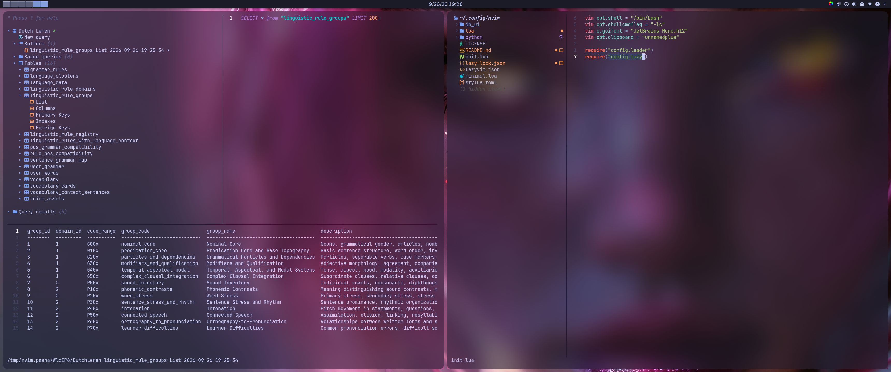

# Linux Development Setup

A personal, Kubuntu-focused setup for software development, data work, and documentation. I bring my tools together with a consistent Tokyo Night look, while keeping their configurations and setup guides in separate places.

This repository is a collection of configurations and instructions, so I can reuse the parts I need and adapt them to each machine and project.

### Neovim Database UI



### Tokyo Night Browser Styling


## Quick Navigation

- [Overview](#overview)
- [My Workflow](#my-workflow)
- [Repository Layout](#repository-layout)
- [Setup Guides](#setup-guides)
- [Getting Started](#getting-started)
- [Privacy and Portability](#privacy-and-portability)

## Overview

This setup brings together the environment around my development work: Kubuntu Plasma, Neovim, Ghostty, JupyterLab, Zsh, browser styling, Obsidian, and reusable AI prompts.

Tokyo Night ties the visual style together across the desktop, terminal, editor, notebooks, and browser. The configurations stay separate, so I can change one tool without having to redo the rest.

## My Workflow

**Neovim is where I write and maintain code.** The setup supports Python, Rust, SQL, Git, Markdown, and AI-assisted development.

**JupyterLab is for notebooks and interactive work.** I use it for notes, experiments, rendered plots and tables, and explanations of results. Reusable code stays in the project package and is edited in Neovim; notebooks can import that code.

For Python projects, I start with the Conda environment template in `environments/environment.yml`, then keep each project's own dependencies and tool settings in its `pyproject.toml`. Rust projects use Cargo, and projects that combine Rust and Python can keep the two parts separate or expose Rust functions to Python when direct integration is useful.

I keep reusable coding and documentation instructions in `prompts/`. The `repoclip` shell function uses Repomix to collect selected project files into AI-friendly context. Before sharing a generated snapshot, I review it for credentials and private information.

## Repository Layout

```text
├── configs/
│   ├── ghosty/                 # Ghostty terminal configuration
│   ├── jupyterlab/             # JupyterLab Tokyo Night CSS
│   ├── nvim/                   # Neovim configuration
│   ├── stylus/                 # Browser styles for individual sites
│   └── zsh/                    # Zsh styling and repoclip function
├── docs/                       # Setup guides and project workflow notes
├── environments/
│   └── environment.yml         # Reusable Conda environment template
└── prompts/                    # Reusable AI prompts
```

The Neovim configuration is also maintained as a separate repository: [flowdrivenml/neovim-data-dev](https://github.com/flowdrivenml/neovim-data-dev).

## Setup Guides

The guides explain why I use each tool and how to install, configure, and adapt it:

- **Desktop and appearance:** [Kubuntu Plasma](docs/Kubuntu%20Setup.md), [Ghostty](docs/Ghostty%20Setup.md), [Stylus browser styling](docs/Stylus%20Browser%20Styling.md), and [Obsidian](docs/Obsidian.md).
- **Development workflow:** [Neovim](docs/Neovim%20Setup.md), [JupyterLab](docs/Jupyterlab%20Setup.md), and [Python and Rust project structure](docs/Python%20and%20Rust%20Project%20Structure.md).
- **Shell and AI workflow:** [Zsh](docs/Zsh%20Setup.md), [Repoclip](docs/Repoclip%20Setup.md), and [reusable prompts](docs/Reusable%20Prompts.md).

## Getting Started

Start with the guide for the part you want to set up. The Kubuntu guide covers the desktop; the Neovim, Ghostty, JupyterLab, and Zsh guides cover their respective tools.

For a new Python project, copy the Conda template into the project and follow the Python and Rust project guide. Keep project-specific dependencies in that project’s files rather than treating the shared template as a single environment for every project.

The setup is designed to be applied a piece at a time. Back up an existing configuration before replacing it, and check each guide for external tools or accounts that a feature depends on.

